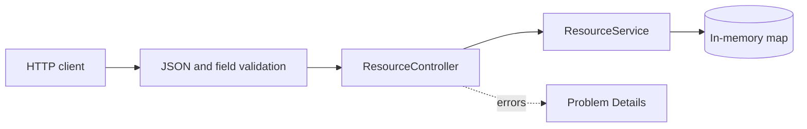

# Learning Inbox

**Save something worth learning. Understand the backend behind it.**

[](https://github.com/miguelgarglez/learning-inbox/actions/workflows/ci.yml)


A small Java API for collecting learning resources, built incrementally to explore
backend engineering through working software, explicit decisions and reproducible tests.

**Current milestone:** create a resource and retrieve it over HTTP, with validation
and consistent errors. Storage is in memory. This is a local learning project:
there is no authentication and restarting loses all data.

## Try it

Requires **JDK 21** and **Maven 3.9+**. Check `java -version` and `mvn -version`;
both should report Java 21. [Java setup and Maven commands (Spanish)](docs/java-tooling.md).

```sh
git clone https://github.com/miguelgarglez/learning-inbox.git
cd learning-inbox
mvn verify
mvn spring-boot:run
```

The API listens on `http://127.0.0.1:8080`. In another terminal, from the project directory:

```sh
curl -i http://127.0.0.1:8080/api/resources \
  -H 'Content-Type: application/json' \
  --data-binary @requests/create-resource.json
```

Example response (ID and timestamp vary):

```http
HTTP/1.1 201 Created
Location: /api/resources/7aeea7eb-505f-4eed-b163-c72b4fbf5958
Content-Type: application/json
```

```json
{
  "id": "7aeea7eb-505f-4eed-b163-c72b4fbf5958",
  "title": "Transacciones en PostgreSQL",
  "url": "https://www.postgresql.org/docs/current/tutorial-transactions.html",
  "reason": "Entender qué ocurre cuando falla una escritura",
  "status": "PENDING",
  "createdAt": "2026-09-09T18:00:00Z"
}
```

Retrieve it with `curl -i http://127.0.0.1:8080` followed by the **actual Location
path from your response**. Stop the server with Ctrl+C. There is no web page at `/`.

## API at a glance

| Request | Success | Expected errors |
| --- | --- | --- |
| `POST /api/resources` | `201` with resource and Location | `400` for invalid input |
| `GET /api/resources/{id}` | `200` with resource | `400` for malformed ID; `404` when absent |

Titles are trimmed and limited to 200 characters. URLs must be absolute HTTP(S)
URLs with a host and no embedded credentials. Links are stored without fetching
them. Errors use `application/problem+json`.

[Full contract (Spanish)](docs/product.md) · [Manual requests](requests/README.md)

## How it works



One application, one Maven module, packages organized by feature. The request DTO
is distinct from the resource model. Spring provides HTTP routing, validation and
dependency injection; the service creates IDs and timestamps and stores resources.

[Architecture and tradeoffs](docs/architecture.md) · [First architecture decision](docs/adr/0001-start-with-an-in-memory-api.md)

## Verification

```sh
mvn verify                           # tests + executable JAR
mvn -Dtest=ResourceApiTest test       # HTTP contract tests
java -jar target/learning-inbox-0.0.1-SNAPSHOT.jar
```

The suite contains **12 test cases**. It starts a real embedded HTTP server on a
random port and uses a fresh application context for each case. It checks
round-trip data, generated identifiers, validation boundaries and error responses.

GitHub Actions runs `mvn verify` with Java 21 on pushes to `main` and pull requests.
[Testing strategy and its limits](docs/testing.md).

## Learning roadmap

| Milestone | Status | Engineering focus |
| --- | --- | --- |
| Create → retrieve | Implemented | Java, HTTP, validation, automated tests |
| Persistent resources | Planned | PostgreSQL, migrations, constraints, transactions |
| Private resources | Planned | Authentication, ownership, authorization tests |
| Failure and concurrency experiments | Planned | Races, retries, recovery, invariants |
| Operate and measure | Planned | Reproducible load, observability, deployment |

Notes and Markdown export are future product features. They are not implemented yet.

## Working with AI agents

AI assistance is part of development. [AGENTS.md](AGENTS.md) defines project boundaries
and verification expectations. Changes should state the problem, explain meaningful
tradeoffs and provide evidence from checks actually executed. Generated code is
reviewed against the product contract; tests are evidence for tested behavior,
not proof of production readiness.

Learning guides are in Spanish: [first session](docs/first-session.md),
[Java tooling](docs/java-tooling.md), [domain glossary](docs/glossary.md).

See [CONTRIBUTING.md](CONTRIBUTING.md) for the contribution workflow.
